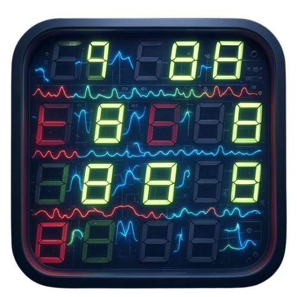
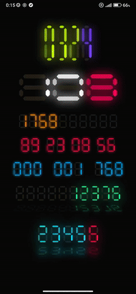
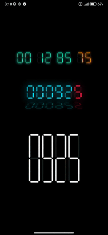
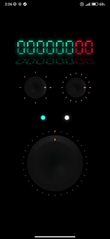
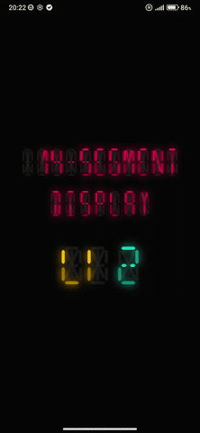
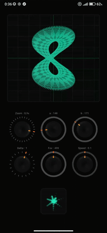
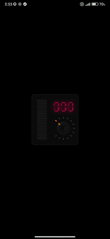
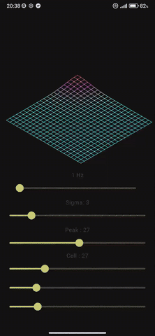

  

---

# Retro Display Components – Jetpack Compose

A set of realistic UI components built with Jetpack Compose, including:  
- 7- and 14-segment displays with advanced visual effects (bevel, glow, flicker, reflection).  
- Individual LEDs or vertical LED bars like VU meters.  
- Analog rotary knobs (inspired by Marshall / Moog style).  
- Full customization support: color, alpha, size, animation, state, style.

---

## 🧩 Included Components

### `SevenSegmentDigitDisplay`

Photorealistic single 7-segment digit display with standard proportions (equal vertical and horizontal segments).

- Visual effects: glow, flicker, dynamic bevel.  
- Supports digit input (`digit`) or manual segment control (`manualSegments`).  
- Centered display, ideal for precise composition.

---

### `SevenSegmentDigitDisplayAlt`

Customizable 7-segment digit display with independently adjustable horizontal segment length.

- Allows stylish vertical/horizontal compression.  
- Used in `FiveDigitDisplay`.  
- Supports `digit`, `char`, or manual segment input.

---

### `SevenSegmentDigitDisplayExtended`

Fully featured customizable 7-segment display with all enhancements.

---

### `FourteenSegmentDisplayExtended`

Ultra-complete 14-segment display with:  
- Realistic effects: glow, bevel, flicker, idle animation.  
- Support for letters, digits, and manual configuration.  
- Configurable spinner-style idle animation.

---

### `FiveDigitDisplay`

Horizontally displays five independent 7-segment digits with individual customization.

- Uses `SevenSegmentDisplayVariante` for each digit.  
- Supports color, glow, flicker, alpha, thickness, bevel, spacing.  
- Optional 3D rotation (`rotationXAngle`, `rotationYAngle`, `cameraAdjustment`).

---

### `FiveDigitDisplayWithReflect`

Double display with realistic reflection effect beneath the main digits.

- Uses `FiveDigitDisplay` twice: main display + flipped reflection.  
- Controls for angle, alpha, and simulated perspective.  
- Perfect for mirror effects on dark backgrounds.

---

### `Multi7SegDisplay`

Dynamic multi-digit 7-segment display (digits/letters).

- Uses a list of `SevenSegmentConfig`.  
- Supports `overrideValue` (e.g., `"1234"`), reversed display (`reversedOverride`), conditional spacing.  
- Optional reflection display with custom `ReflectConfig`.

---

### `Multi14SegDisplay`

Photorealistic multi-character 14-segment display for uppercase letters, digits, or symbols.

- Displays a string (`text`) or a list of digits (`digits`).  
- Supports configurable spacing and a global `FourteenSegmentConfig`.

---

### `LedBarGraph`

Vertical LED bar simulating an audio VU meter or level indicator.

- LEDs animated with flicker, glow, and peak hold indicator with fade.  
- Independent color per LED, dynamically customizable.  
- Supports global alpha, glow radius, peak duration, vertical spacing.

---

### `RealisticLED`

Single LED component with realistic visual effect, blinking, and halo glow.

- Configurable color, size, blink interval, and halo spacing.  
- Simulates a retro LED with smooth, realistic rendering even when off.

---

### `RotaryKnob`

Realistic interactive rotary knob with infinite rotation.

- Style inspired by analog amps (Moog, Marshall).  
- Visual effects:  
  - Rotating bevel simulating light reflection.  
  - Dynamic highlight on the knob center.  
  - Illuminated cursor.  
  - Stylized ticks with active tick indicator.  
- Features:  
  - 360° rotation with smooth animated interpolation.  
  - Configurable detents (click stops).  
  - Haptic feedback per detent.  
  - Smooth animation between detents.

---

### `SimpleNeonOscilloscope`

Stylized neon oscilloscope displaying Lissajous curves.

- Shapes: sine, square, triangle, chaos, random.  
- Supports custom shapes via lambda.  
- Parameters: thickness, color, glow style, frequency.

---

| Component                      | Type                  | Key Features                                                |
|--------------------------------|-----------------------|-------------------------------------------------------------|
| `SevenSegmentDigitDisplay`     | 7 segments            | Standard proportions, glow & flicker effects                |
| `SevenSegmentDigitDisplayAlt`  | 7 segments            | Independent horizontal segment, advanced styling            |
| `SevenSegmentDigitDisplayExt`  | 7 segments            | Independent horizontal segment, advanced styling            |
| `SevenSegmentDisplay`          | 7 segments            | Independent horizontal segment, advanced styling            |
| `FourteenSegmentDisplay`       | 14 segments           | Letters, digits, idle animation, manual segments            |
| `FiveDigitDisplay`             | 7 segments x5         | Multiple customizable digits                                |
| `FiveDigitDisplayWithReflect`  | 7 segments x5 + refl. | Realistic mirror reflection                                 |
| `Multi7SegDisplay`             | Dynamic 7 segments    | String / override / optional reflection                     |
| `Multi14SegDisplay`            | Dynamic 14 segments   | Full text, global config                                    |
| `LedBarGraph`                  | Vertical LED bar      | VU meter, animated peak, multiple colors                    |
| `RealisticLED`                 | Single LED            | Glow, blink, halo                                           |
| `RotaryKnob`                   | Rotary knob           | Max realism, detents, haptics, dynamic light effects        |
| `RotaryKnobLimited`            | Rotary knob           | Max realism, detents, haptics, dynamic light effects        |
| `SimpleNeonOscilloscope`       | Decoration            | Animated shapes, glow, custom waveform                      |
| `Fractal visualizer`           | Visualizer            | Animated shapes, glow, custom waveform                      |
| `Wave forms visualizer`        | Visualizer            | Animated shapes, glow, custom waveform                      |

---

##  Screenshots

| 7-segments | 7-segments more | Rotary Knob + LED | 14-segments |
|:---:|:---:|:---:|:---:|
|  |  |  |  |

| Oscilloscope deco | Fractal visualizer | LED bar | Frequency Map visualizer |
|:---:|:---:|:---:|:---:|
| |  | |  |

---

## Technologies Used

- **Jetpack Compose**: Native UI rendering engine.  
- **2D Canvas**: Manual rendering of segments, LEDs, and curves.  
- **RenderEffect / BlurMaskFilter**: Glow and halo effects.  
- **Compose Animations**: For flicker, blinking, and interpolation.  
- **Kotlin Multiplatform Ready**: Code compatible with Jetpack Compose Desktop (with adaptations).

---

